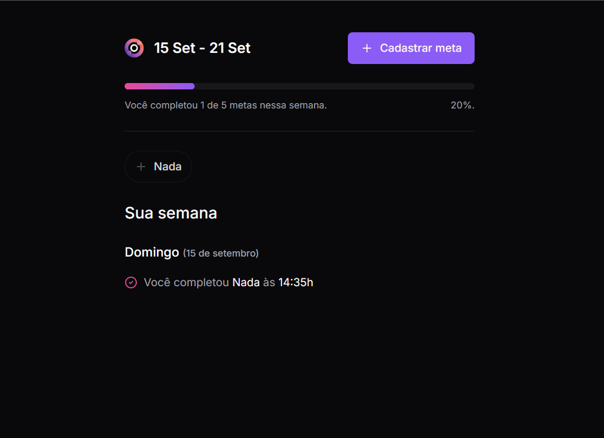
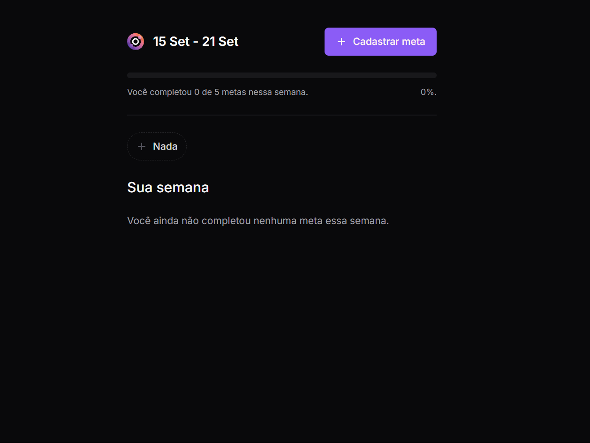
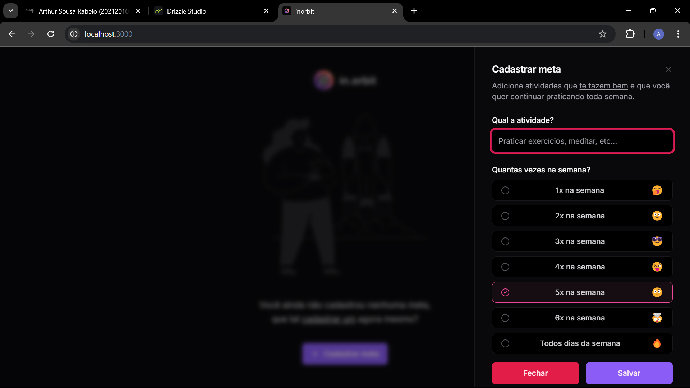

# FIn.orbit

## Ferramentas
- Aplicação usando Next.js
- Usando Tailwindcss
- Usando schad ui

## Rodar o projeto

- primeiro instalar o nodejs versão LTS
- npm install para instalar todas as dependência
- npm run dev

## Projeto Back-end

<a href='https://github.com/arthur-uzumaki/in.orbit-server'>back-end</a>